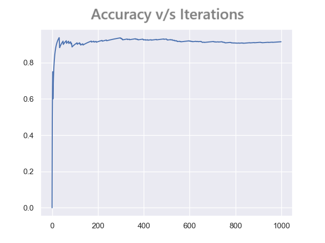
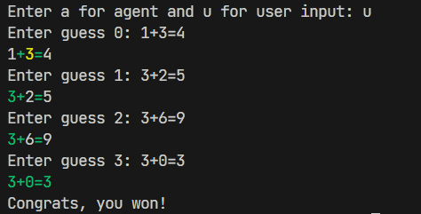
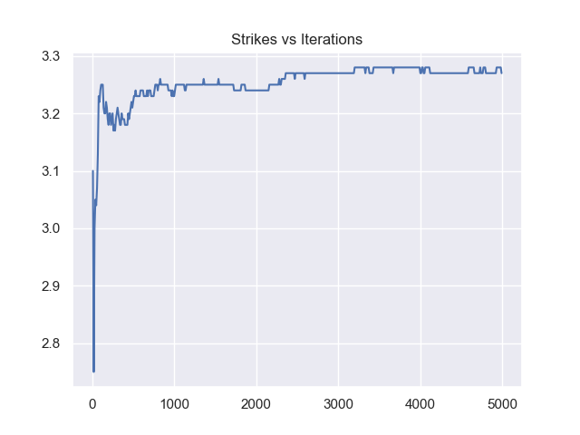

You'll find the detailed report and documentation of Nawabs' solution of the 'Absurd Agents' PS here!

<h2>The Problem Statement</h2>
<ol>
<li>Implement a server that allows people to play word games like
Wordle, its variants, and Hangman. Details are left to your
imagination, but there should be a feature to let us use our dictionary.</li>
<li>For each game in your service, implement agents that play the game
optimally, mentioning the rationale behind your choice of algorithms
in the report. Rule of thumb, more stats == more marks. </li>
</ol>

<h2>Introduction</h2>
We present a novel interface for implementing a server that allows us to play word games like Wordle, Hangman, etc. 
Steps you should follow:
- Choose the word game. 
- Choose whether you want to play as user or you want the agent to play. 
- If former option is selected then our program will help the user (in case of wordle, and nerdle) in guessing or will make the user play. </li>
- If the latter option is selceted then the agent will ask us to enter number of iterations and play the games. The stats: `accuracy` and `strike rate` will be produced after running.

<h3>The Games</h3>
<ol>
  <li>Wordle: Wordle is a web based word game. Players have six attempts to guess a five-letter word, with feedback given for each guess in the form of colored tiles indicating when letters match or occupy the correct position. Every day, a five-letter word is chosen which players aim to guess within six tries. After every guess, each letter is marked as either green, yellow or gray: green indicates that letter is correct and in the correct position, yellow means it is in the answer but not in the right position, while gray indicates it is not in the answer at all. Multiple instances of the same letter in a guess, such as the "o"s in "robot", will be colored green or yellow only if the letter also appears multiple times in the answer; otherwise, excess repeating letters will be colored gray. 
 </li>
  <li>Hangman: Hangman is a guessing game. We'll have a pre-decided word, which we will have to guess. he word to guess is represented by a row of dashes representing each letter or number of the word. Rules may permit or forbid proper nouns, such as names, places, brands, or slang. If the guessing player suggests a letter which occurs in the word, the other player writes it in all its correct positions. Otherwise kf the letter is not in the word then, one of our chances will be eliminated. </li>
  <li>Nerdle: Nerdle is a guessing game like Wordle, but here we have to form a basic mathematical equation using numbers and symbols. </li>
  <li>Word Ladder: Word ladder is a word game where we have the start word and a specified end word. We have to find a chain of other words to link the two, in which two adjacent words (that is, words in successive steps) differ by one letter.</li>
  <li>Jumble: In this game, we pick a word from the lexicon, and try to unjumble it. </li>
</ol>

<h3>Interface</h3>
We present a novel interface for implementing a server that allows us to play word games like Wordle, Hangman, etc. 
Steps you should follow:
- Choose the word game. 
- Choose whether you want to play as user or you want the agent to play. 
- If former option is selected then our program will help the user (in case of wordle, and nerdle) in guessing or will make the user play. </li>
- If the latter option is selceted then the agent will ask us to enter number of iterations and play the games. The stats: `accuracy` and `strike rate` will be produced after running.

<h2>Hangman</h2>

### Table of Contents

- [Definitions](#definitions)
- [Approaches Explored](#approaches-explored)
  - [ShannoNgram](#shannongram)
  - [Simple N-gram Votes](#simple-n-gram-votes)
  - [Final Modified N-gram Votes Approach](#final-modified-n-gram-votes-approach)

#### Definitions

- **Mask:** The incomplete word served by the Hangman server (e.g., "app_e" is a mask).
- **N-gram:** An ordered sequence of consecutive characters of length N. (e.g., "app" is a 3-gram of "apple").
- **Order:** The current value of N, which decides the set of N-grams that are used for decision-making.

We have implemented a voting based heuristic method, that achieved a 61.1% success rate at
guessing hangman words from an unseen lexicon in 6 strikes.

#### Approaches Explored

##### ShannoNgram

The ShannoNgram approach is based on a mix of information theory and N-grams (length N substrings of words), which are widely used in natural language processing.

1. In this approach, we first iterate through all the words in the training dictionary and extract all substrings of different lengths (2, 3, 4, 5, 6 in our case) and store them in separate dictionaries. For each N-gram, we also record their total frequencies across all words and the cumulative frequency of all N-grams for each N.

2. We start with the highest N possible (6 if len(word) > 6 or len(word)-1 otherwise). Given a mask, we select only those N-grams that would fit the mask and record the positions they would fit in. We remove the rest from the N-gram dictionary.

3. We then make a list of all the candidate characters that could be guessed next (characters that appear in a fitting N-gram and aren't already guessed).

4. For each candidate, we try to model the possible outcomes of the guess by assuming that an N-gram is part of the actual word and create a new prospective mask. We then compute the likelihood of the prospective mask using information entropy.

5. Using information entropy, we select the character with the maximum entropy as our guess.


```python
def shannongram(self, mask):
    self.update_ngrams(mask)
    self.update_candidates(mask)
    while len(self.current_ngrams[self.n]) <= 1 and self.n > self.n_min:
        self.n -= 1
        self.update_ngrams(mask)
        self.update_candidates(mask)
    info = {}
    if mask.count("_") <= 3 and len(self.current_ngrams[self.n]) < 200:
        for char in self.candidates:
            info[char] = 0
        for ngram in self.current_ngrams[self.n]:
            if not char in ngram:
                continue
            new_masks = self.new_masks(mask, ngram, char)
            assert len(new_masks) > 0
            for new_mask in new_masks:
                if len(self.potential_ngrams(new_mask, char)) == 0:
                    continue
                info[char] += self.info(new_mask, char)
    ans = max(info, key=info.get)
    # ans = random.choices(list(info.keys()), weights=list(info.values()), k=1)[0]
    if self.verbose:
        print(info)
        print(f"Shannongram agent guesses {ans}")
    self.guessed_letters[ans] = self.n
    return str(ans), info
```

We tried sampling using information as probability weights instead of deterministically choosing
the first one, but that yielded worse results.
The main problem with this approach is its complexity: computing information in such an
exact manner requires us to consider too many possibilities, which makes inference slow. While
the approach seems theoretically sound, the slower speed would hinder faster iteration so, we
decided to switch to a faster approach.


#### Efficient N-gram Votes

In this approach, we use the set of potential N-grams of the maximum non-empty order to decide the next guess. It showed similar results to the ShannoNgram approach and was much faster and simpler, so I decided to go ahead with it.

Each N-gram casts k*f votes for a candidate character if there are k instances of it in the N-gram, and f is the number of words in the given lexicon where the N-gram occurs.

Instead of computing the information gained from each candidate character, which is computationally very expensive, we efficiently count the number of "votes" it receives across all N-grams and choose the character with the maximum votes.

The order (value of N) is initialized to a fixed value, say 9 (or the mask length, whichever is lower). Whenever there are no matching N-grams left, we shift the order by -1 and consider the set of (N-1) grams instead.

Also, since I observed that 'e', 'a', and 'i' were the most common initial guesses, I hardcoded the method to guess these first and then use the votes method.

```python
def vote(self, mask):
    self.update_ngrams(mask)
    self.update_candidates(mask)
    # ensures order with non-empty N-gram dictionary
    while len(self.current_ngrams[self.n]) < 1 and self.n > self.n_min:
        self.n -= 1
        self.update_ngrams(mask)
        self.update_candidates(mask)
    votes = {}
    for ngram in self.current_ngrams[self.n]:
        for char in ngram:
            if char in self.candidates:
                if char in info:
                    votes[char] += (self.current_ngrams[self.n][ngram])
                else:
                    votes[char] = (self.current_ngrams[self.n][ngram])
    ans = max(votes, key=info.get)
    # ans = random.choices(list(info.keys()), weights=list(info.values()), k=1)[0]
    if self.verbose:
        print(ans)
    self.guessed_letters.append(ans)
    return str(ans)
```

#### Error Analysis of Efficient N-gram Voting Method

The model delivers around 56% accuracy on practice trials but is still relatively naive. Here are some issues:

1. It incorporates very limited information about the position of the blank characters, which leads to it making guesses that would be non-plausible to a native speaker due to knowledge of common consonant clusters, etc. For example, for "o c u l o m o t o r _," the agent guesses "b" since it has more votes even though it is unlikely such an N-gram would occur in a terminal position.

2. The model does not make distinctions between semantically valid and non-valid n-grams. This can cause it to miss guesses which are simple as they contain other words embedded. For example, 'u n _ o r o u s n e s s' is easy if the agent has the information that "porousness" is a complete word and should have more weight on the outcome.

3. The fixed order makes it ignore very plausible N-grams of a lower order.

#### Final Modified N-gram Votes Approach

We attempted to introduce some minor changes into the voting method to address the deficiencies observed in the error analysis.

1. We modified the voting algorithm to give N-grams which occur as whole words in the lexicon more weight. After some experimentation (trying constant multiplicative factor, N, and 𝑁²), we settled on multiplying the N-gram frequency by 𝑁² where N is the word length, to compute the votes for a single occurrence of a character. This ensures that matching N-grams that are whole words have more weight, and the weight increases with length as exact matches of higher lengths tend to be more informative. This ensures that a matching semantically meaningful N-gram receives appropriate attention.

2. To incorporate more information, we tried a double-order approach that cumulated votes from N-grams of lengths N as well as N-1 (weighed lower), which was slower but did not seem to yield substantially better results. (Maybe we did not weigh down the N-1 grams enough due to paucity of time.)

Again, we tried sampling instead of deterministic max selection, but that yielded worse results.

Here's the final code:

```python
def vote(self, mask):
    self.update_ngrams(mask)
    self.update_candidates(mask)
    
    while len(self.current_ngrams[self.n]) < 1 and self.n > self.n_min:
        self.n -= 1
        self.update_ngrams(mask)
        self.update_candidates(mask)
    
    votes = {}
    
    for ngram in self.current_ngrams[self.n]:
        k = 1
        
        if ngram in self.word_ngrams[self.n] and self.n == 5:
            k = self.n
        elif ngram in self.word_ngrams[self.n] and self.n >= 6:
            k = self.n^2
        
        for char in ngram:
            if char in self.candidates:
                if char in votes:
                    votes[char] += k * (self.current_ngrams[self.n][ngram])
                else:
                    votes[char] = k * (self.current_ngrams[self.n][ngram])
    
    ans = max(votes, key=votes.get)
    
    # ans = random.choices(list(votes.keys()), weights=list(votes.values()), k=1)[0]
    
    if self.verbose:
        print(ans)
    
    self.guessed_letters.append(ans)
    return str(ans)
```


<h2>Wordle</h2>
Wordle is a word-guessing game where the player has to guess a five-letter word in six attempts. The game provides feedback after each guess, indicating which letters are correct and in the right position, which letters are correct but in the wrong position, and which letters are incorrect. The player can use this feedback to make educated guesses and narrow down the possible words.

The game is implemented in Python using the `random` module to select a random word from a list of valid words. The player's guesses are taken as input using the `input()` function, and the feedback is generated using a combination of string manipulation and list comprehension.

## About the agent


The approach to solving Wordle involves generating a list of possible words based on the feedback provided by the game. This list is initially populated with all valid five-letter words, and then filtered down based on the feedback received for each guess.

The first step is to generate a list of all possible combinations of five letters, which is done using the `itertools` module. This list is then filtered down based on the feedback received for each guess, using a combination of string manipulation and list comprehension.

The filtering process involves comparing each possible word to the feedback received for the previous guess, and eliminating any words that do not match. This is done by comparing the position and identity of each letter in the word to the feedback received, and eliminating any words that do not match.

Once the list of possible words has been narrowed down to a few candidates, the solver can make an educated guess based on the frequency of each letter in the English language. This involves calculating the frequency of each letter in the remaining possible words, and selecting the most common letter as the next guess.

The process is repeated until the correct word is guessed, or until the maximum number of guesses is reached.

## Statistics

Two approaches were considered while creating an agent for playing the game - one based on information theory and other based on exhaustive search.

The information theory-based approach is implemented in the `info` function in the `solver.py` file. This approach involves calculating the entropy of each possible word based on the feedback received for each guess. The entropy is a measure of the amount of uncertainty associated with a random variable, and in this case, it represents the number of possible words that match the feedback received. The solver then selects the word with the lowest entropy as the next guess, as this word provides the most information about the remaining possible words. 

The code finds the most optimal guess based on the recieved feedback of the previous guesses. It find the information gain for each possible word in the dictionary for each possible feedback(243 to be exact). It then chooses the word with the highest information game as the next guess. This approach was computationally very expensive and thus the first four most optimal guesses were precomputed on a dictionary of around 13000 words.

```python
for i, word in enumerate(bigDict):
                sum = 0
                #print("The word is : " + word)
                for feedback in self.constState:
                    temp = WordleSolver(dict, self.optimal_second)
                    test = word+feedback
                    #print(temp.dictionary)
                    temp.update(test)
                    size = len(temp.dictionary)
                    p = size/float(og_size)
                    if size != 0:
                        sum -= p*math.log(p, 2)
                        #print("word: " + word + feedback + "info: " + str(math.log(p, 2)))
                        #print("The info gain is:" + str(sum) + " for word " + word + " and feedback " + feedback)     
                if sum > max:
                    max = sum
                    optimal = i
            return optimal
```

On the other hand, the exhaustive search approach involves generating all possible combinations of five letters and testing each one against the feedback received for each guess. This approach is computationally expensive and not practical for large dictionaries and it also struggles with words such as jolly since it correctly generates the mask _olly but ends up guessing holly, molly, lolly with no optimal way to choose the best guess among them. 

Both approaches were implemented, and accuracy was compared. Information theory was found to have a higher level of accuracy but higher computational power was required. Thus we ended up precomputing the first four most optimal guesses computed using information theory on a dictionary of almost 13000 words. 

We have achieved a `97.9%` accuracy using a dictionary of `12953` words, with an average strike rate of `4.451`.



<h2>Nerdle</h2>
 Nerdle

An implementation of [Nerdle](nerdlegame.com) allowing for use of both user input and an agent that plays the game.

> Note: This is a version of the Nerdle called Micro Nerdle with 5 characters instead of 8.

Nerdle rules:
* There are 5 “letters”
* A “letter” is one of "0123456789+-*/="
* And a word must be a calculation that is mathematically correct. So it must have one “=”
* Also, the number on the right of the “=” is just a number (not another calculation)
* Standard order of operations applies, so calculate * and / before + and -
* Order matters in nerdle. If the answer we’re looking for is 1+2=3, then 2+1=3 isn’t close enough.
* You have 6 chances to guess the expression.
* You cannot enter a previously entered guess or a guess containing a letter that has been found to not be in the expression.

Examples of valid solutions:
* `3*3=9`
* `1+3=4`
* `6/6=1`
* `8-3=5`
* `2*0=0`
### How to play?

Launch `play.py` to start the game. 
Green represents correct position of the correct letter.
Yellow represents incorrect position but letter is present in the expression.
Normal text represents the absence of a letter.

## Example



### Description of Agent

The solver in `./solver/core.py` is a Python class called `Solver` that contains a method called `solve`. The `solve` method takes in a string representing the Nerdle expression and returns a string representing the solution to the expression.

The algorithm used by the `Solver` class is an exhaustive approach that generates all possible permutations of the 5 letters in the expression and evaluates each permutation to see if it is a valid solution. The evaluation is done by parsing the expression into a list of tokens, then using a stack to evaluate the expression according to the order of operations. If the expression evaluates to the correct value, the permutation is considered a valid solution and returned.

The `Solver` class also contains a method called `get_possible_permutations` that generates all possible permutations of the 5 letters in the expression. This method is used by the `solve` method to generate the permutations that are evaluated.

The `Solver` class is used by the `play.py` script to solve the Nerdle expression entered by the user or generated by the agent. The `play.py` script prompts the user for input and displays the results of each guess, including the number of correct and incorrect letters. If the user does not guess the expression correctly within 6 attempts, the solution is displayed and the game ends. If the agent is playing, it uses the `Solver` class to generate a solution and make guesses until it either solves the expression or runs out of attempts.

### Statistics

The solver achieves 100% accuracy and average strike rates around 3.2-3.7, averaged across 5000 iterations




<h2>Jumble</h2>
# Unjumble the Word

**Unjumble the Word** is the ultimate brain-teasing challenge that puts your puzzle-solving skills to the test.

## Definitions

- **jumbleSolver:** The automated Word Unjumble Solver object, an ingenious Python-based agent designed to efficiently tackle the trickiest word jumbles with extremely high accuracy in the Word Unjumble game.
- **selectedWord:** The word that is selected by the game to maximize complexity for the user.
- **jumbledWord:** The jumbled word that is generated for the user to decipher.
- **The User:** The person who engages themselves in playing the unjumble game.

## Approach

The implementation of this game involves two main parts:

### The Unjumble-the-Word Game

We start by choosing a word from a Python list in an external file containing 500 words. These words were statistically selected from 3000 words to maximize complexity for the user, utilizing the built-in random library. The order of letters in the selected word is then randomized using the Mersenne Twister PRNG algorithm as the core generator.

The user is presented with the jumbled word and prompted to guess the original word. If the user's guessed word is correct, they win, receive congratulations, and the game ends. If the guess is incorrect, the user is informed and prompted to guess again. This feedback process continues until the user guesses the correct word.

### The Agent

The **Word Unjumble Solver** is an ingenious Python-based agent designed to effortlessly conquer the trickiest word jumbles in the game. The solver is trained on an extensive vocabulary and can efficiently guess the right word with an extremely high accuracy. This is achieved by a highly customized implementation of linear search. The algorithm boasts near-perfect accuracy and blazing-fast speed, producing the guess in less than 100ms.

<h2>Word Ladder</h2>

**Definitions**

**Connected words:** Two words are said to be connected to each
other if they both have the same characters at all except **only**
**one** index.

**Mesh:** A data structure containing all the connections of words,
implemented as a dictionary.

**Start:** The initial word provided by the server.

**Target:** The final word we have to reach from the start.

**Current** **word:** The word we currently are at.

**Step:** The number of changes made to the start.

**Branch:** One path from the start to the current word.

**Depth** **of** **a** **Branch:** Number of words in the branch

<h3>Approach to solve</h3>

**Breadth-first search algorithm**

The Breadth-first search algorithm is based on searching for all paths
that are possible to be taken from the start. Each path or branch is
calculated simultaneously, i.e., the depth of all branches is the same
after each iteration.

All the words explored during computations are stored after each
iteration, and the target is searched each time before the next
iteration of the loop starts. Once we find the target, we exit the loop,
and each branch is then searched for the target. The branch containing
the target is the shortest path possible i.e. the optimal solution of
the given word ladder.
